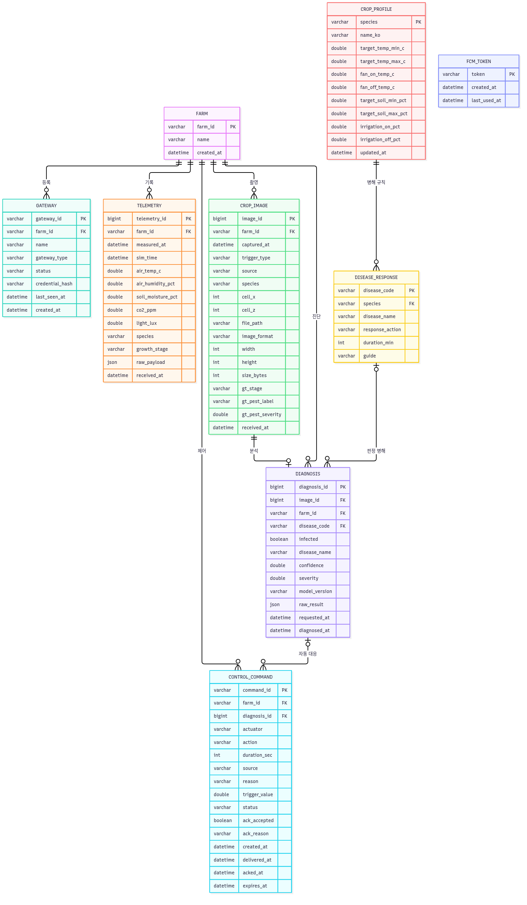
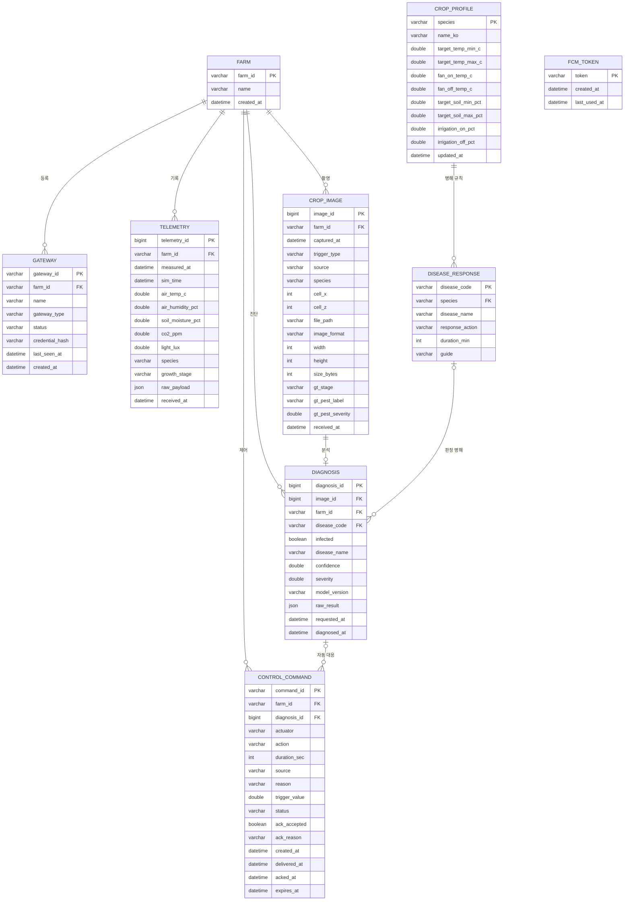

# ERD 명세서

| 항목 | 내용 |
|---|---|
| 시스템 | AI 기반 개방형 모바일 스마트팜 관리 시스템 — Backend |
| DBMS | MySQL 8.4 (문자셋 `utf8mb4`, 정렬 `utf8mb4_0900_ai_ci`, 엔진 InnoDB) |
| 작성 | 김승윤 (백엔드) |
| 버전 | v0.1 초안 (2026-09-28) — 9/29 회의에서 확정 예정 |
| 관련 문서 | `jwt-db-draft.md` (설계 배경과 회의 안건), API-001·API-004 명세 |

## 1. 작성 규칙
- 테이블과 컬럼 이름은 `snake_case`를 쓴다.
- 모든 시각은 `DATETIME(3)`에 **한국 시간(Asia/Seoul)**으로 저장한다. 시뮬레이터가 보내는 UTC 시각은 저장할 때 변환한다.
- 작물별 기준값처럼 바뀔 수 있는 값은 코드에 두지 않고 테이블(`crop_profile`, `disease_response`)에 둔다.
- 로그성 데이터(텔레메트리, 명령, 사진, 진단)는 삭제 연쇄(CASCADE)를 쓰지 않는다. 이력이 실수로 지워지지 않게 하기 위해서다.

## 2. ERD

## 3. 테이블 목록
| # | 테이블 | 한글명 | 설명 | 관련 API |
|---|---|---|---|---|
| 1 | `farm` | 농장 | 관리 대상 농장. 현재는 `greenhouse-01` 1개 | 전체 |
| 2 | `gateway` | 게이트웨이(기기) | JWT를 발급받는 기기. 현재는 Unity 시뮬레이터 | API-008 |
| 3 | `telemetry` | 환경 데이터 | 온도, 토양 수분 등 센서 이력 | API-001, 002 |
| 4 | `control_command` | 제어 명령 | 명령 대기열 + 제어 이력 + 자동 대응 이력 | API-003, 007 |
| 5 | `crop_image` | 작물 사진 | 시뮬레이터가 보낸 사진의 메타데이터 (파일은 디스크에 저장) | API-004 |
| 6 | `diagnosis` | AI 진단 | 사진별 병해충 진단 결과 | API-005, 006, 007 |
| 7 | `crop_profile` | 작물 기준값 | 작물별 적정 범위와 제어 임계값 | 자동제어 |
| 8 | `disease_response` | 병해 대응 규칙 | 병해별 자동 대응 방식 | 자동 대응 |
| 9 | `fcm_token` | 푸시 토큰 | 알림을 받을 모바일 기기 | 알림 |

## 4. 테이블 정의

### 4-1. `farm` — 농장
| 컬럼 | 타입 | NULL | 키 | 기본값 | 설명 |
|---|---|---|---|---|---|
| farm_id | VARCHAR(50) | N | PK | | 농장 ID. 시뮬레이터 `SimConfig.farmId` (예: `greenhouse-01`) |
| name | VARCHAR(100) | N | | | 표시 이름 |
| created_at | DATETIME(3) | N | | CURRENT_TIMESTAMP(3) | 등록 시각 |

### 4-2. `gateway` — 게이트웨이(기기)
| 컬럼 | 타입 | NULL | 키 | 기본값 | 설명 |
|---|---|---|---|---|---|
| gateway_id | VARCHAR(50) | N | PK | | 기기 ID (예: `SIM001`). JWT의 `sub` |
| farm_id | VARCHAR(50) | N | FK | | 소속 농장 → `farm.farm_id`. JWT의 `farmId` |
| name | VARCHAR(100) | N | | | 예: `스마트팜 시뮬레이터 1` |
| gateway_type | VARCHAR(20) | N | | `SIMULATOR` | 코드: `SIMULATOR`, `GATEWAY` |
| status | VARCHAR(20) | N | | `ACTIVE` | 코드: `ACTIVE`, `INACTIVE`. `INACTIVE`면 토큰 발급과 API 접근 모두 거부 |
| credential_hash | VARCHAR(100) | N | | | 기기 비밀값의 BCrypt 해시. 원문은 저장하지 않는다 |
| last_seen_at | DATETIME(3) | Y | | | 마지막 인증 요청 시각. 앱의 "기기 연결 상태" 표시에 사용 |
| created_at | DATETIME(3) | N | | CURRENT_TIMESTAMP(3) | 등록 시각 |

### 4-3. `telemetry` — 환경 데이터
- 자동제어 판단은 텔레메트리를 받을 때마다 하고, 이 테이블에는 **정해진 주기(안: 1분)마다 1건**만 저장한다. 저장 주기는 9/29 회의에서 확정한다.
- 센서가 설치되지 않아 `-1`이 오면 `NULL`로 저장한다.

| 컬럼 | 타입 | NULL | 키 | 기본값 | 설명 |
|---|---|---|---|---|---|
| telemetry_id | BIGINT | N | PK | AUTO_INCREMENT | |
| farm_id | VARCHAR(50) | N | FK | | → `farm.farm_id` |
| measured_at | DATETIME(3) | N | | | 측정 시각 (API-001 `timestampUtc`를 KST로 변환) |
| sim_time | DATETIME(3) | Y | | | 시뮬레이션 안의 시각 (`simTimeUtc`, 이미 지역 시각) |
| air_temp_c | DOUBLE | Y | | | 기온 ℃ (`sensors.airTempC`) |
| air_humidity_pct | DOUBLE | Y | | | 상대습도 % (`sensors.airHumidityPct`) |
| soil_moisture_pct | DOUBLE | Y | | | 토양 수분 % (`sensors.soilMoisturePct`) |
| co2_ppm | DOUBLE | Y | | | CO₂ ppm (`sensors.co2Ppm`) |
| light_lux | DOUBLE | Y | | | 조도 lux (`sensors.lightLux`) |
| species | VARCHAR(20) | Y | | | 대표 식물 종류 (`crop.species`) |
| growth_stage | VARCHAR(20) | Y | | | 대표 식물 생육 단계 (`crop.stage`) |
| raw_payload | JSON | Y | | | 원본 전체. 저장 여부는 회의에서 결정 |
| received_at | DATETIME(3) | N | | CURRENT_TIMESTAMP(3) | 서버 수신 시각 |

### 4-4. `control_command` — 제어 명령
- 명령 대기열(API-003), 제어 이력, AI 자동 대응 이력을 이 테이블 하나로 관리한다.
- 앱의 활동 로그(예: "30℃ 초과, 순환팬 가동")는 `reason`, `trigger_value`, `created_at`으로 만든다.
- 시뮬레이터의 결과 보고(`commandTrace`)는 텔레메트리와 함께 오며, `command_id`로 찾아 `ack_*` 컬럼을 채운다.

| 컬럼 | 타입 | NULL | 키 | 기본값 | 설명 |
|---|---|---|---|---|---|
| command_id | VARCHAR(40) | N | PK | | 예: `cmd_a1b2c3`. 시뮬레이터 `commandTrace.id`와 같은 값 |
| farm_id | VARCHAR(50) | N | FK | | → `farm.farm_id` |
| diagnosis_id | BIGINT | Y | FK | | AI 자동 대응일 때 원인 진단 → `diagnosis.diagnosis_id` |
| actuator | VARCHAR(30) | N | | | 대상 장치. 코드: `circFan`, `waterPump`, `ventFan` (API-001 `actuators` 이름) |
| action | VARCHAR(10) | N | | | 코드: `on`, `off` |
| duration_sec | INT | Y | | | 가동 시간(초). 병해 대응처럼 정해진 시간만 켤 때 사용 |
| source | VARCHAR(20) | N | | | 코드: `AUTO`(임계값), `AI`(병해 대응), `MANUAL`(앱에서 수동) |
| reason | VARCHAR(30) | N | | | 코드: 5장 참고 |
| trigger_value | DOUBLE | Y | | | 판단 당시 측정값 (예: 31.2℃, 28%) |
| status | VARCHAR(20) | N | | `PENDING` | 코드: `PENDING`, `DELIVERED`, `ACKED`, `REJECTED`, `EXPIRED` |
| ack_accepted | BOOLEAN | Y | | | 시뮬레이터 수락 여부 (`commandTrace.accepted`) |
| ack_reason | VARCHAR(255) | Y | | | 결과 설명 (`commandTrace.reason`) |
| created_at | DATETIME(3) | N | | CURRENT_TIMESTAMP(3) | 명령 생성 시각 |
| delivered_at | DATETIME(3) | Y | | | 시뮬레이터가 명령을 가져간 시각 |
| acked_at | DATETIME(3) | Y | | | 결과 보고를 받은 시각 |
| expires_at | DATETIME(3) | Y | | | 이 시각까지 전달되지 않으면 `EXPIRED` 처리 |

### 4-5. `crop_image` — 작물 사진
- 이미지 파일은 서버 디스크에 저장하고, DB에는 경로와 메타데이터만 둔다.
- `gt_*` 컬럼은 시뮬레이터가 보내는 **평가용 정답**이다. AI 진단 요청(API-005)에는 **절대 넣지 않는다.** AI 정확도를 계산할 때만 쓴다.
- 저장 정책(모두 저장할지, 주기 사진은 줄일지)은 회의에서 확정한다. 30초마다 받으면 하루 수 GB가 쌓인다.

| 컬럼 | 타입 | NULL | 키 | 기본값 | 설명 |
|---|---|---|---|---|---|
| image_id | BIGINT | N | PK | AUTO_INCREMENT | |
| farm_id | VARCHAR(50) | N | FK | | → `farm.farm_id` |
| captured_at | DATETIME(3) | N | | | 촬영 시각 (`timestampUtc`를 KST로 변환) |
| trigger_type | VARCHAR(10) | N | | | 코드: `routine`(주기), `pest`(감염 즉시) |
| source | VARCHAR(20) | N | | | 코드: `dataset-photo`, `render`, `stage-photo`, `pest-photo` |
| species | VARCHAR(20) | Y | | | 찍힌 식물 종류. 식물이 없으면 NULL |
| cell_x, cell_z | INT | Y | | | 찍힌 식물의 격자 좌표 |
| file_path | VARCHAR(255) | N | | | 서버 파일 경로 |
| image_format | VARCHAR(10) | N | | | 코드: `jpg`, `png` |
| width, height | INT | N | | | 픽셀 크기 |
| size_bytes | INT | N | | | 파일 크기 |
| gt_stage | VARCHAR(20) | Y | | | 정답 생육 단계 (`groundTruthStage`) |
| gt_pest_label | VARCHAR(30) | Y | | | 정답 병해 라벨 (`groundTruthPestLabel`, 예: `tomato-A`) |
| gt_pest_severity | DOUBLE | Y | | | 정답 진행도 0~1 (`groundTruthPestSeverity`) |
| received_at | DATETIME(3) | N | | CURRENT_TIMESTAMP(3) | 서버 수신 시각 |

### 4-6. `diagnosis` — AI 진단
| 컬럼 | 타입 | NULL | 키 | 기본값 | 설명 |
|---|---|---|---|---|---|
| diagnosis_id | BIGINT | N | PK | AUTO_INCREMENT | |
| image_id | BIGINT | N | FK, UQ | | 진단한 사진 → `crop_image.image_id`. 사진 1장당 진단 1건 |
| farm_id | VARCHAR(50) | N | FK | | → `farm.farm_id`. 농장별 병해 로그 조회용 |
| disease_code | VARCHAR(30) | Y | FK | | 판정된 병해 → `disease_response.disease_code`. 정상이면 NULL |
| infected | BOOLEAN | N | | | 병해 발생 여부 |
| disease_name | VARCHAR(50) | Y | | | 병명 (예: `잎곰팡이병`) |
| confidence | DOUBLE | Y | | | 신뢰도 0~1 |
| severity | DOUBLE | Y | | | 중증도 (AI 출력 형식 확정 후 범위 결정) |
| model_version | VARCHAR(30) | Y | | | AI 모델 버전 |
| raw_result | JSON | Y | | | AI 응답 원본 |
| requested_at | DATETIME(3) | N | | | AI에 요청한 시각 |
| diagnosed_at | DATETIME(3) | Y | | | 결과를 받은 시각. 실패하면 NULL |

### 4-7. `crop_profile` — 작물 기준값
- **히스테리시스:** 켜는 기준과 끄는 기준을 다르게 둬서 기준값 근처에서 장치가 계속 켜졌다 꺼지는 것을 막는다(기능 명세).
  - 순환팬: `air_temp_c ≥ fan_on_temp_c`이면 ON, `air_temp_c ≤ fan_off_temp_c`이면 OFF
  - 관수: `soil_moisture_pct ≤ irrigation_on_pct`이면 ON, `soil_moisture_pct ≥ irrigation_off_pct`이면 OFF
- `target_*`는 앱 화면에 보여 줄 적정 범위다.

| 컬럼 | 타입 | NULL | 키 | 기본값 | 설명 |
|---|---|---|---|---|---|
| species | VARCHAR(20) | N | PK | | 코드: `Tomato`, `Pepper`, `Cucumber`, `Strawberry`, `Lettuce` |
| name_ko | VARCHAR(20) | N | | | 토마토, 고추, 오이, 딸기, 상추 |
| target_temp_min_c | DOUBLE | N | | | 적정 온도 하한 ℃ |
| target_temp_max_c | DOUBLE | N | | | 적정 온도 상한 ℃ |
| fan_on_temp_c | DOUBLE | N | | | 순환팬 ON 온도 ℃ |
| fan_off_temp_c | DOUBLE | N | | | 순환팬 OFF 온도 ℃ (`fan_on_temp_c`보다 낮아야 함) |
| target_soil_min_pct | DOUBLE | N | | | 적정 토양 수분 하한 % |
| target_soil_max_pct | DOUBLE | N | | | 적정 토양 수분 상한 % |
| irrigation_on_pct | DOUBLE | N | | | 관수 ON 수분 % |
| irrigation_off_pct | DOUBLE | N | | | 관수 OFF 수분 % (`irrigation_on_pct`보다 높아야 함) |
| updated_at | DATETIME(3) | N | | CURRENT_TIMESTAMP(3) ON UPDATE | 마지막 수정 시각 |

### 4-8. `disease_response` — 병해 대응 규칙
| 컬럼 | 타입 | NULL | 키 | 기본값 | 설명 |
|---|---|---|---|---|---|
| disease_code | VARCHAR(30) | N | PK | | 병해 라벨 (예: `tomato-A`). AI 출력 코드와 같아야 함 |
| species | VARCHAR(20) | N | FK | | → `crop_profile.species` |
| disease_name | VARCHAR(50) | N | | | 병명 |
| response_action | VARCHAR(20) | N | | | 코드: `FAN_ON`, `NOTIFY_ONLY` |
| duration_min | INT | Y | | | `FAN_ON`일 때 가동 시간(분) |
| guide | VARCHAR(255) | Y | | | 앱 알림에 보여 줄 권장 조치 |

### 4-9. `fcm_token` — 푸시 토큰
- 앱에 로그인이 없으므로 사용자 대신 기기의 FCM 토큰만 저장하고, 등록된 모든 기기에 알림을 보낸다.

| 컬럼 | 타입 | NULL | 키 | 기본값 | 설명 |
|---|---|---|---|---|---|
| token | VARCHAR(255) | N | PK | | FCM 등록 토큰 |
| created_at | DATETIME(3) | N | | CURRENT_TIMESTAMP(3) | 등록 시각 |
| last_used_at | DATETIME(3) | Y | | | 마지막 발송 성공 시각. 오래된 토큰 정리에 사용 |

## 5. 관계 정의
| 부모 | 자식 | 관계 | FK 컬럼 | 삭제 규칙 |
|---|---|---|---|---|
| farm | gateway | 1 : N | gateway.farm_id | RESTRICT |
| farm | telemetry | 1 : N | telemetry.farm_id | RESTRICT |
| farm | control_command | 1 : N | control_command.farm_id | RESTRICT |
| farm | crop_image | 1 : N | crop_image.farm_id | RESTRICT |
| farm | diagnosis | 1 : N | diagnosis.farm_id | RESTRICT |
| crop_image | diagnosis | 1 : 0..1 | diagnosis.image_id (UNIQUE) | RESTRICT |
| diagnosis | control_command | 0..1 : N | control_command.diagnosis_id | SET NULL |
| crop_profile | disease_response | 1 : N | disease_response.species | RESTRICT |
| disease_response | diagnosis | 0..1 : N | diagnosis.disease_code | SET NULL |

## 6. 인덱스
| 테이블 | 인덱스 | 컬럼 | 용도 |
|---|---|---|---|
| telemetry | idx_telemetry_farm_time | (farm_id, measured_at) | 현재 상태 조회, 1시간/24시간/7일 그래프 |
| control_command | idx_command_farm_status | (farm_id, status, created_at) | 시뮬레이터가 가져갈 대기 명령 조회 (API-003) |
| control_command | idx_command_farm_time | (farm_id, created_at) | 제어 로그 조회 (API-007) |
| crop_image | idx_image_farm_time | (farm_id, captured_at) | 최근 사진 조회 |
| diagnosis | uq_diagnosis_image | (image_id) UNIQUE | 사진 1장당 진단 1건 보장 |
| diagnosis | idx_diagnosis_farm_time | (farm_id, diagnosed_at) | 병해 로그 조회 |

## 7. 코드값 정의
**control_command.reason**
| 코드 | 의미 | 발생 조건 |
|---|---|---|
| `TEMP_HIGH` | 고온 | 온도 ≥ `fan_on_temp_c` → 순환팬 ON |
| `TEMP_NORMAL` | 온도 정상화 | 온도 ≤ `fan_off_temp_c` → 순환팬 OFF |
| `SOIL_LOW` | 토양 수분 부족 | 수분 ≤ `irrigation_on_pct` → 관수 ON |
| `SOIL_ENOUGH` | 토양 수분 충분 | 수분 ≥ `irrigation_off_pct` → 관수 OFF |
| `PEST_RESPONSE` | 병해 자동 대응 | 진단 결과의 `response_action`이 `FAN_ON` |
| `MANUAL` | 수동 제어 | 앱에서 직접 조작 (구현 여부 미정) |

**control_command.status**
| 코드 | 의미 |
|---|---|
| `PENDING` | 생성됨, 시뮬레이터가 아직 가져가지 않음 |
| `DELIVERED` | 시뮬레이터가 가져감 (API-003 응답에 포함됨) |
| `ACKED` | 시뮬레이터가 수락하고 실행함 |
| `REJECTED` | 시뮬레이터가 거절함 (정전 등) |
| `EXPIRED` | `expires_at`까지 전달되지 않음 |

## 8. 초기 데이터
**farm / gateway**
| 테이블 | 값 |
|---|---|
| farm | `greenhouse-01`, 스마트팜 온실 1 |
| gateway | `SIM001`, farm `greenhouse-01`, `SIMULATOR`, `ACTIVE`. 비밀값은 서버 환경 변수로 받아 해시만 저장 |

**crop_profile** — 토마토만 임시값이고, 나머지 4종은 값이 필요하다.
| species | 적정 온도 | 팬 ON / OFF | 적정 수분 | 관수 ON / OFF | 근거 |
|---|---|---|---|---|---|
| Tomato | 22 ~ 26℃ | 27℃ / 25℃ | 30 ~ 50% | 30% / 50% | UI 시안 값. 노션 "토마토 생육 환경"(낮 21~29.5℃)과 달라 확정 필요 |
| Pepper, Cucumber, Strawberry, Lettuce | 미정 | 미정 | 미정 | 미정 | 자료 조사 필요 |

**disease_response** — 병명은 API-004 명세의 라벨 대응표 기준. 대응 방식은 토마토만 노션 자료가 있다.
| disease_code | 작물 | 병명 | 대응 | 근거 |
|---|---|---|---|---|
| tomato-A | 토마토 | 잎곰팡이병 | FAN_ON 60분 | 과습이 원인이라 환기가 핵심 (노션), 60분은 UI 시안 |
| tomato-B | 토마토 | 황화잎말이바이러스 | NOTIFY_ONLY | 치료 약제 없음, 감염 개체 제거 안내 |
| pepper-A | 고추 | 고추마일드모틀바이러스 | 미정 | |
| pepper-B | 고추 | 고추점무늬병 | 미정 | |
| cucumber-A | 오이 | 모자이크바이러스 | 미정 | |
| strawberry-A | 딸기 | 잿빛곰팡이병 | 미정 | |
| strawberry-B | 딸기 | 흰가루병 | 미정 | |
| lettuce-A | 상추 | 균핵병 | 미정 | |
| lettuce-B | 상추 | 노균병 | 미정 | |

## 9. 확정 전 확인할 것
1. `telemetry` 저장 주기와 `raw_payload` 저장 여부
2. `crop_image` 저장 정책 (디스크 용량)
3. `gateway`와 `device` 중 어떤 이름을 쓸지
4. AI 출력의 병해 코드가 `tomato-A` 형식인지 (김우주 님), 중증도의 형식(0~1 수치인지 초기/중기/말기인지)
5. 5개 작물의 기준값과 병해 대응 방식
6. 수동 제어(`MANUAL`)를 구현할지
