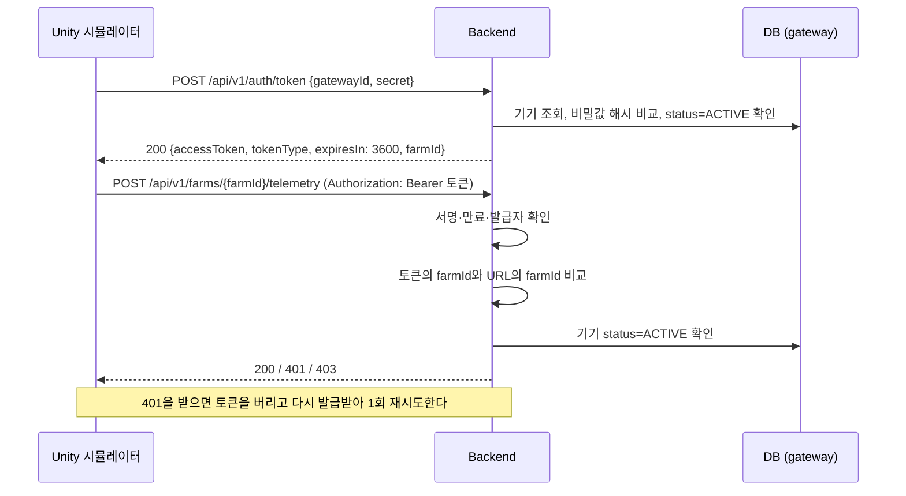
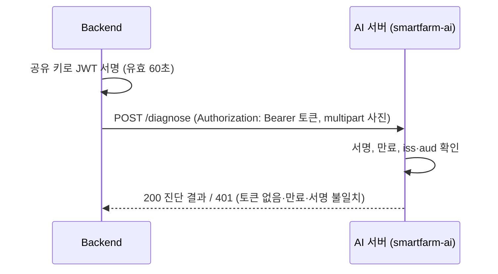

# JWT 인증 방식

- 작성: 김승윤 (백엔드) / 2026-10-02
- 상태: 시뮬레이터 구간은 **구현·배포 완료**, AI 구간은 **설계안**(현재는 API 키 방식)
- 관련 문서: `docs/api/api-spec-draft.md` (API-009), `docs/design/erd-spec.md` (`gateway` 테이블)

## 1. 원칙

| 구간 | 인증 | 근거 |
|---|---|---|
| 시뮬레이터(기기) → 백엔드 | **JWT** | 등록된 기기만 센서값·사진을 보내고 제어 명령을 가져가게 한다 |
| 백엔드 → AI 서버 | **JWT** | 9/29 회의 결정. 백엔드만 AI 추론을 호출할 수 있게 한다 |
| 모바일 앱 → 백엔드 | 없음 (HTTPS만) | MVP 범위에서 사용자 로그인을 만들지 않는다 |

- **사용자 로그인은 없다.** 회원가입, 사용자 계정, 세션, 재발급 토큰(refresh token)을 만들지 않는다.
- JWT는 **서버 간 통신**(기기 ↔ 백엔드, 백엔드 ↔ AI)에서 "허가된 상대인지" 확인하는 용도로만 쓴다.
- 통신은 모두 HTTPS다. 테스트 서버는 Cloudflare 터널이 HTTPS를 처리한다.

## 2. 구간 1 — 시뮬레이터 → 백엔드 (구현 완료)

### 2-1. 흐름

### 2-2. 토큰
| 항목 | 값 |
|---|---|
| 발급 API | `POST /api/v1/auth/token` (API-009) |
| 서명 | HS256. 서명 키는 서버 환경 변수 `JWT_SECRET` (32바이트 이상) |
| 내용 (claim) | `iss`=`smartfarm-backend`, `sub`=기기 ID(`SIM001`), `farmId`=농장 ID(`greenhouse-01`), `iat`, `exp` |
| 유효 시간 | 1시간 (`jwt.expires-in-seconds`) |
| 재발급 | 재발급 토큰 없음. 만료되면 발급 API를 다시 호출한다 |

### 2-3. 검증 (요청마다)
JWT를 요구하는 경로는 기기용 세 가지다: `POST …/telemetry`(API-001), `POST …/images`(API-004), `GET …/commands`(API-003).

| 순서 | 확인 | 실패 시 응답 |
|---|---|---|
| 1 | `Authorization: Bearer` 헤더, 서명, 만료, 발급자 | 401 `{"error": "invalid or expired access token"}` |
| 2 | 토큰의 `farmId` = URL의 `{farmId}` | 403 `{"error": "farm access denied"}` |
| 3 | DB의 기기 상태가 `ACTIVE` | 403 `{"error": "gateway inactive"}` |

- 3번을 매 요청 확인하므로, 기기를 `INACTIVE`로 바꾸면 남은 토큰 유효 시간과 상관없이 즉시 차단된다.
- 검증이 끝나면 기기의 마지막 접속 시각(`gateway.last_seen_at`)을 갱신한다(30초에 한 번).

### 2-4. 기기 등록과 비밀값
- 서버를 시작할 때 농장 `greenhouse-01`과 기기 `SIM001`이 없으면 등록한다.
- 기기 비밀값은 서버 환경 변수 `SEED_GATEWAY_SECRET`으로 받고, DB에는 BCrypt 해시(`gateway.credential_hash`)만 저장한다.
- 비밀값과 `JWT_SECRET`은 서버의 `/opt/smartfarm/.env`에만 있다. 저장소, 노션, 단체 채팅에 올리지 않는다. 시뮬레이터 담당자에게는 개인 메시지로 전달한다.

### 2-5. 구현 위치
| 역할 | 코드 |
|---|---|
| 발급 API | `auth/AuthController` |
| 서명·검증 | `auth/JwtTokenService` |
| 요청 검증 필터 | `auth/GatewayAuthFilter` |
| 기기 테이블 | `farm/Gateway`, `farm/SeedDataLoader` |

배포된 테스트 서버에서 확인한 결과(2026-10-02): 토큰 발급 200, 틀린 비밀값 401, 토큰 없는 전송 401, 토큰 포함 전송 200(DB 저장 확인), 다른 농장 경로 403.

## 3. 구간 2 — 백엔드 → AI 서버 (설계안)

현재는 `X-API-Key` 헤더에 고정 키를 넣는 방식이다(`ai/AiClientConfig`). 9/29 회의 결정에 따라 JWT로 바꾼다.

### 3-1. 방식
백엔드와 AI 서버가 **서명 키 하나를 공유**하고, 백엔드가 요청마다 **유효 시간이 짧은 JWT**를 만들어 보낸다. 토큰 발급 API가 필요 없어 가장 단순하다.

| 항목 | 값 |
|---|---|
| 서명 | HS256. 공유 키는 양쪽 환경 변수 `AI_SERVICE_JWT_SECRET` (같은 값, 32바이트 이상) |
| 내용 (claim) | `iss`=`smartfarm-backend`, `aud`=`smartfarm-ai`, `iat`, `exp` |
| 유효 시간 | 60초. 요청마다 새로 만든다 |
| 헤더 | `Authorization: Bearer <JWT>` |
| AI 서버의 검증 | 서명, `exp`, `iss`, `aud`. 실패하면 401 |

- 고정 API 키와 달리, 토큰이 중간에 노출돼도 60초 뒤에는 쓸 수 없다.
- 기기용 서명 키(`JWT_SECRET`)와는 **다른 키**를 쓴다. 한쪽 키가 노출돼도 다른 구간에 영향이 없게 하기 위해서다.

### 3-2. 전환 순서
한쪽만 먼저 바꾸면 지금 동작하는 AI 호출이 끊긴다. 아래 순서로 바꾼다.

1. AI 서버가 **API 키와 JWT를 둘 다 허용**하도록 먼저 바꾼다.
2. 양쪽 서버에 `AI_SERVICE_JWT_SECRET`을 넣는다.
3. 백엔드가 `X-API-Key` 대신 JWT를 보내도록 바꾸고 배포한다. `/api/v1/ai/status`로 확인한다.
4. AI 서버에서 API 키 허용을 뺀다.

### 3-3. 담당
- 백엔드 쪽(토큰 생성, 헤더 교체): 김승윤
- AI 서버 쪽(토큰 검증): 김우주

## 4. 시뮬레이터 현재 구현과의 차이

노현석 님이 공유한 디버그 키트(모의 서버, 가짜 Unity)의 로그인 방식은 이 문서와 다르다. **API 형식은 이 문서와 API 명세가 기준**이므로, 시뮬레이터가 아래에 맞춰야 한다.

| 항목 | 백엔드 (기준) | 시뮬레이터 현재 구현 |
|---|---|---|
| 발급 경로 | `POST /api/v1/auth/token` | `POST /auth/login` |
| 요청 | `{gatewayId, secret}` | `{farmId, deviceId, secret}` |
| 응답 | `{accessToken, tokenType, expiresIn, farmId}` | `{accessToken, refreshToken, expiresInSec}` |
| 갱신 | 없음. 만료되면 다시 발급 | `POST /auth/refresh`, 실패하면 다시 로그인 |
| 유효 시간 | 1시간 | 10분 |

- 시뮬레이터는 갱신에 실패하면 스스로 다시 로그인하므로, 발급 경로와 요청·응답 필드 이름만 바꾸면 된다.
- 401을 받았을 때 토큰을 버리고 1회 재시도하는 동작과 에러 응답 형식은 이미 같다.

## 5. 남은 결정
1. AI 구간 JWT 방식(3장)에 대한 김우주 님 확인과 전환 시점
2. 시뮬레이터의 로그인 형식 변경 시점 (노현석 님)
3. 기기를 여러 대 등록해야 하는 경우의 등록 방법 (지금은 서버 시작 시 1대만 등록)
