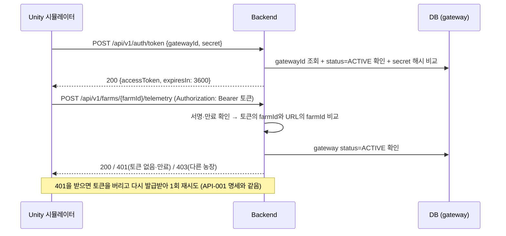
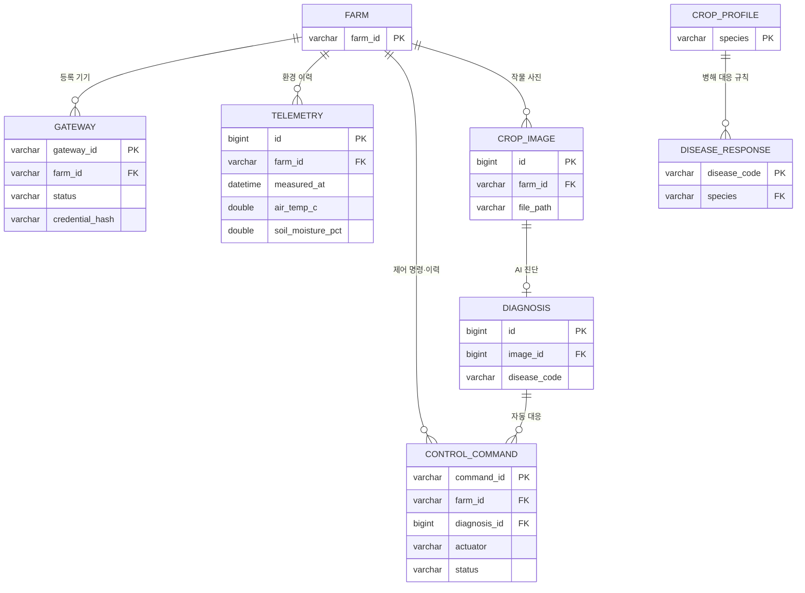

# JWT 인증 흐름 및 DB 설계 초안

- 작성: 김승윤 (백엔드) / 2026-09-28
- 목적: 9/29 회의에서 JWT 방식, DB 구조, 수집·저장 주기를 확정하기 위한 초안
- 근거: 9/23 회의록 "JWT 인증 방식 흐름", API-001·API-004 명세(노현석), 기능 명세(장세민), 제출용 제안서 2차

---

## 1. JWT 인증 흐름

### 1-1. 원칙 (이미 결정된 것)
- JWT는 **기기(시뮬레이터, 향후 게이트웨이) 인증에만** 쓴다. 모바일 앱은 로그인 없이 HTTPS로 호출한다.
- 통신은 HTTPS다. 테스트 서버는 Cloudflare 터널이 HTTPS를 처리한다.
- 기기의 최초 인증 정보는 개발할 때 미리 등록하고, JWT는 백엔드가 발급한다.

### 1-2. 흐름

### 1-3. 제안 내용
| 항목 | 제안 | 이유 |
|---|---|---|
| 기기 식별자 | `gatewayId` (예: `SIM001`) | 9/23 문서처럼 개별 센서가 아니라 게이트웨이가 등록 단위다 |
| 농장 식별자 | `farmId` (예: `greenhouse-01`) | API-001·004가 이미 URL에 `farmId`를 쓴다 |
| 토큰 발급 API (API-008) | `POST /api/v1/auth/token` | 요청 `{gatewayId, secret}`, 응답 `{accessToken, tokenType: "Bearer", expiresIn}` |
| 토큰 내용 (claim) | `sub`=gatewayId, `farmId`, `iat`, `exp`, `iss`=smartfarm-backend | 403(농장 불일치) 판단에 `farmId`가 필요하다 |
| 서명 | HS256, 서버 비밀키는 환경 변수 `JWT_SECRET` | 발급자와 검증자가 같은 서버라 비대칭 키가 필요 없다 |
| 만료 | 1시간 | 짧게 두고, 만료되면 기기가 비밀값으로 다시 발급받는다 |
| 재발급(refresh token) | **두지 않음** | 기기는 비밀값을 갖고 있어 다시 로그인하면 된다. API-001의 "401 → 재로그인 → 1회 재시도"와 맞는다 |
| 인증 정보 저장 | **1안**: `gateway.credential_hash` (BCrypt) | 지금 규모에 충분하다. 비밀값 원문은 저장하지 않는다 |
| 기기 차단 | `gateway.status`를 `INACTIVE`로 바꾸면 즉시 차단 | 요청마다 DB에서 상태를 확인한다 |
| 기기 등록 | 서버 시작 시 환경 변수의 기기 1대를 등록 (없을 때만) | 관리자 화면 없이 개발용 기기를 등록한다 |

### 1-4. API별 인증
| 호출 주체 | API | 인증 |
|---|---|---|
| 시뮬레이터 | 토큰 발급 (API-008) | gatewayId + secret |
| 시뮬레이터 | 텔레메트리 (API-001), 이미지 (API-004), 제어 명령 조회·ACK (API-003) | **JWT** |
| 모바일 | 상태 조회 (API-002), 로그 조회 (API-007), FCM 토큰 등록 | 없음 (HTTPS만) |
| AI 서버 | 진단 요청·결과 (API-005·006) | 회의에서 결정 (아래 3번) |

---

## 2. DB 설계 초안 (MySQL)

### 2-1. ERD

### 2-2. 테이블
**farm**: 농장 (현재는 `greenhouse-01` 1개)
| 컬럼 | 타입 | 설명 |
|---|---|---|
| farm_id | VARCHAR(50) PK | 시뮬레이터 `SimConfig.farmId` |
| name | VARCHAR(100) | 표시 이름 |
| created_at | DATETIME | |

**gateway**: 백엔드에 접속하는 기기 (JWT 발급 대상)
| 컬럼 | 타입 | 설명 |
|---|---|---|
| gateway_id | VARCHAR(50) PK | 예: `SIM001` |
| farm_id | VARCHAR(50) FK | 소속 농장 |
| name, type | VARCHAR | 예: `스마트팜 시뮬레이터 1`, `SIMULATOR` |
| status | VARCHAR(20) | `ACTIVE` / `INACTIVE` |
| credential_hash | VARCHAR(100) | 비밀값의 BCrypt 해시 |
| last_seen_at | DATETIME | 마지막 요청 시각 (모바일 "기기 연결 상태" 표시에 사용 가능) |

**telemetry**: 환경 데이터 이력 (API-001)
| 컬럼 | 타입 | 설명 |
|---|---|---|
| id | BIGINT PK | |
| farm_id | VARCHAR(50) FK | |
| measured_at | DATETIME | `timestampUtc` |
| sim_time | DATETIME | `simTimeUtc` (가속된 모사 시각) |
| air_temp_c, air_humidity_pct, soil_moisture_pct, co2_ppm, light_lux | DOUBLE | 센서 없음(-1)은 NULL로 저장 |
| species, growth_stage | VARCHAR | 대표 식물 (`crop.species`, `crop.stage`) |
| raw_payload | JSON | 원본 전체 (저장 여부는 3번에서 결정) |
| 인덱스 | | (farm_id, measured_at) — 그래프 조회용 |

**control_command**: 제어 명령 큐 + 제어 이력 + 자동 대응 이력 (API-003)
- 명령을 만들 때 원인과 값을 함께 저장하면, 모바일의 "활동 로그"(예: "30℃ 초과, 순환팬 가동")를 이 테이블 하나로 만들 수 있다.

| 컬럼 | 타입 | 설명 |
|---|---|---|
| command_id | VARCHAR(40) PK | 예: `cmd_a1b2c3` (시뮬레이터 `commandTrace.id`와 대응) |
| farm_id | VARCHAR(50) FK | |
| actuator | VARCHAR(30) | `circFan`, `waterPump`, `ventFan` 등 (API-001 `actuators` 이름) |
| action | VARCHAR(10) | `on` / `off` |
| duration_sec | INT NULL | 병해 대응 시 가동 시간 (예: 3600) |
| source | VARCHAR(20) | `AUTO`(임계값) / `AI`(병해 대응) / `MANUAL` |
| reason | VARCHAR(30) | `TEMP_HIGH`, `TEMP_NORMAL`, `SOIL_LOW`, `SOIL_ENOUGH`, `PEST_RESPONSE` |
| trigger_value | DOUBLE NULL | 판단 당시 값 (예: 31.2℃, 28%) |
| diagnosis_id | BIGINT FK NULL | AI 대응일 때 원인 진단 |
| status | VARCHAR(20) | `PENDING` → `DELIVERED` → `ACKED` / `REJECTED` / `EXPIRED` |
| created_at, delivered_at, acked_at | DATETIME | |
| ack_accepted, ack_reason | BOOLEAN, VARCHAR | 텔레메트리 `commandTrace`의 `accepted`, `reason` |

**crop_image**: 작물 사진 (API-004)
| 컬럼 | 타입 | 설명 |
|---|---|---|
| id | BIGINT PK | |
| farm_id | VARCHAR(50) FK | |
| captured_at | DATETIME | |
| trigger_type | VARCHAR(10) | `routine` / `pest` |
| species, cell_x, cell_z | | 찍힌 식물 |
| file_path | VARCHAR(255) | 이미지는 DB가 아니라 파일로 저장 |
| ground_truth_pest, ground_truth_severity | | **평가용 정답. AI 요청에는 절대 넣지 않는다** (API-004 명세) |

**diagnosis**: AI 진단 결과 (API-006)
| 컬럼 | 타입 | 설명 |
|---|---|---|
| id | BIGINT PK | |
| image_id | BIGINT FK | 진단한 사진 |
| diagnosed_at | DATETIME | |
| infected | BOOLEAN | 발생 여부 |
| disease_code, disease_name | VARCHAR | 예: `tomato-A`, `잎곰팡이병` |
| confidence, severity | DOUBLE | 신뢰도, 중증도 |
| model_version | VARCHAR(30) | |

**crop_profile**: 작물별 제어 기준값 (5종, 하드코딩하지 않음)
| 컬럼 | 타입 | 설명 |
|---|---|---|
| species | VARCHAR(20) PK | `Tomato`, `Pepper`, `Cucumber`, `Strawberry`, `Lettuce` |
| name_ko | VARCHAR(20) | |
| target_temp_min_c, target_temp_max_c | DOUBLE | 화면 표시용 적정 범위 (토마토 시안: 22~26℃) |
| fan_on_temp_c, fan_off_temp_c | DOUBLE | 히스테리시스: 이 값 이상이면 ON, 이 값 이하로 내려오면 OFF |
| irrigation_on_pct, irrigation_off_pct | DOUBLE | 히스테리시스: 하한 이하 ON, 상한 도달 OFF (토마토 시안: 30~50%) |

**disease_response**: 병해별 자동 대응 규칙
| 컬럼 | 타입 | 설명 |
|---|---|---|
| disease_code | VARCHAR(30) PK | 예: `tomato-A` |
| species | VARCHAR(20) FK | |
| disease_name | VARCHAR(50) | |
| action | VARCHAR(20) | `FAN_ON` / `NOTIFY_ONLY` |
| duration_min | INT | 예: 60 (UI 시안의 "60분 연속 가동") |
| guide | VARCHAR(255) | 사용자 안내 문구 |

예시 — 토마토 (노션 "토마토 생육 환경" 기준)
| disease_code | 병명 | action | 근거 |
|---|---|---|---|
| tomato-A | 잎곰팡이병 | FAN_ON 60분 | 과습이 원인이라 환기가 핵심 |
| tomato-B | 황화잎말이바이러스 | NOTIFY_ONLY | 치료 약제 없음. 감염 개체 제거 안내 |

**fcm_token**: 모바일 푸시 알림 대상 (로그인이 없으므로 기기 토큰만 저장)
| 컬럼 | 타입 | 설명 |
|---|---|---|
| token | VARCHAR(255) PK | |
| created_at, last_used_at | DATETIME | |

---

## 3. 회의에서 정할 것

1. **환경 데이터 수집 방향**: API-001(시뮬레이터가 5초마다 POST)과 기능 명세(백엔드가 10분마다 요청)가 다르다.
   - 제안: **API-001 방식으로 받는다.** 시뮬레이터가 이미 그렇게 구현돼 있고, 시뮬레이터에는 수신 서버가 없다.
2. **저장 주기**: 5초마다 전부 저장하면 하루 17,280건이고, 원본 JSON까지 저장하면 용량이 빠르게 늘어난다.
   - 제안: 자동제어 판단은 **받을 때마다** 하고, `telemetry`에는 **1분에 1건**만 저장한다. 원본 JSON은 저장하지 않거나 1분 샘플에만 저장한다.
3. **이미지 저장 (가장 시급)**: 사진이 30초마다 0.4~2.5MB씩 오면 **하루 수 GB**가 쌓여 서버 디스크(20GB)가 며칠 만에 찬다.
   - 제안: `pest` 트리거 사진은 모두 저장하고, `routine` 사진은 **10분에 1장**만 저장하고 진단한다. 또는 시뮬레이터의 이미지 전송 주기를 늘린다(`SimConfig.imageIntervalSec`).
4. **식별자**: 기기 `gatewayId`(SIM001) + 농장 `farmId`(greenhouse-01)로 나누는 것에 동의하는지. 테이블 이름을 gateway로 할지 device로 할지.
5. **시뮬레이터 로그인 형식**: `Net/JwtAuth.cs`에 이미 로그인·갱신 코드가 있다. 요청·응답 필드 이름을 위 1-3의 제안과 맞출지, 시뮬레이터 쪽에 맞출지 노현석 님과 정한다.
6. **AI 서버 연동 방식**: 백엔드가 AI 서버를 호출해 응답으로 결과를 받으면(동기) API-006은 필요 없고, AI 서버 쪽 인증도 단순해진다. 비동기로 AI가 백엔드를 다시 호출한다면 공유 API 키가 필요하다.
7. **기준값 확정**: 토마토 적정 온도가 노션(낮 21~29.5℃)과 UI 시안(22~26℃)에서 다르다. 토양 수분은 노션이 kPa, 시뮬레이터가 %라서 % 기준값이 필요하다. 나머지 4개 작물의 값도 필요하다.
8. **공기 습도 사용 여부**: UI 시안 로그에 "습도 78% 감지 후 순환팬 가동"이 있다. 공기 습도도 제어 조건에 넣을지 정한다.
9. **JWT 구현 분담**: 설계는 김승윤, 구현(발급·검증 필터)은 장세민 님이 맡는 것인지 확인한다.
